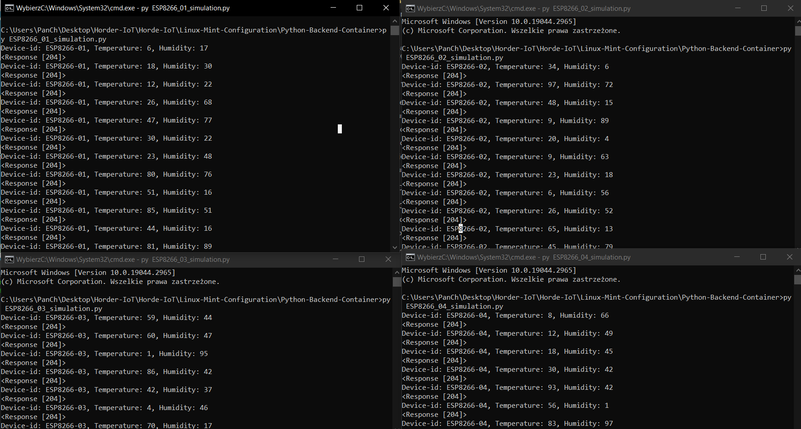

## You need to change the permission of the shell/file script (chmod 777 file_name) before executing!

### 1. Docker on LinuX Mint installation.

```sh
chmod 777 DockerEngine-Installer/docker-installer-mint-2.sh
DockerEngine-Installer/docker-installer-mint-2.sh
```

### 2. InfluxDB container creation.

```sh
cd InfluxDB-Container
chmod 777 influxdb-container-creator.sh
./influxdb-container-creator.sh
cd ..
```

### 3. Python Flask Backend creation.

#### 3.1 InfluxDB token generation.

Generating InfluxDB token.

[!Screenshot](InfluxDB-Token-Generation.png)

After generating we have to save it to the "influxdb_config.json" file!

File "influxdb_config.json" inside of Python-Backend-Container:

```json
{
	"token": "GENERATED_TOKEN_TO_WRITE!",
	"org": "horde-org",
	"hostname":"horde-influxdb",
	"port":"8086",
	"bucket": "horde-bucket"
}
```

#### 3.2 Flask-Backend container creation.

```sh
cd Python-Backend-Container
chmod 777 flask-influxdb-backend-container-creator.sh
./flask-influxdb-backend-container-creator.sh
cd ..
```

### 4. InfluxDB-Backend Docker Network creation.

```sh
chmod 777 DockerNetwork-Creator/influxdb-backend-network-creator.sh
DockerNetwork-Creator/influxdb-backend-network-creator.sh
```

### 5. Resetting all containers in order to proper host mapping after network creation!

```sh
docker stop horde-influxdb
docker start horde-influxdb

docker stop horde-backend
docker start horde-backend
```

### * Available simulation of ESP8266 x 4 in "ESP8266-Simulation" folder:

File "ESP8266_0X_simulation.py" inside of Python-Backend-Container/ESP8266-Simulation:

```py
import json
import requests
import random
import time

f = open("flask_config.json")
influxdb_config = json.load(f)
url = influxdb_config["url"]

while(True):
    device_id = "ESP8266-01"
    temperature = random.randint(0, 100)
    humidity = random.randint(0, 100)
    print(f"Device-id: {device_id}, Temperature: {temperature}, Humidity: {humidity}")
    response = requests.post(f"{url}/device-measurement", json=
                  {"device-id":device_id, 
                   "temperature":temperature, 
                   "humidity":humidity}
                   )
    print(response)
    time.sleep(1)

```
File  "flask_config.json" inside Python-Backend-Container/ESP8266-Simulation:

```json
{
	"url": "http://localhost:7007"
}
```


